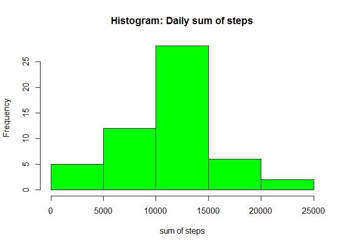
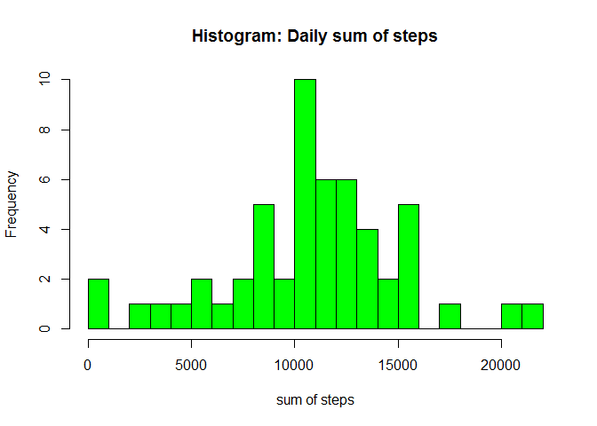
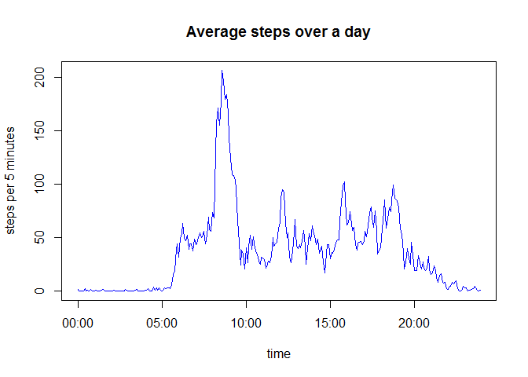
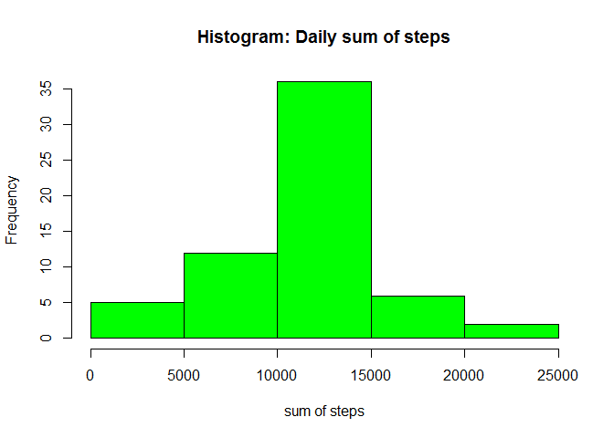
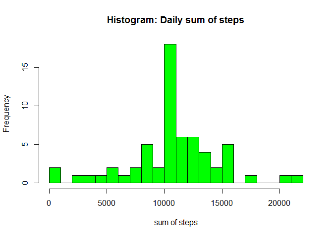
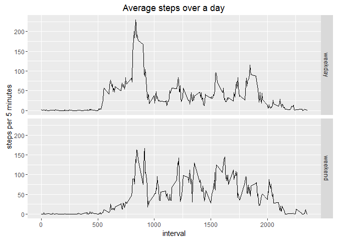

# Reproducible Research: Peer Assessment 1

This is a short analysis of the data from a personal step counting device.
You can download the data file here: 
[data set](https://d396qusza40orc.cloudfront.net/repdata%2Fdata%2Factivity.zip) [52 k]

Please make sure to store the unzipped file "activity.csv" at the same folder as this markdown document.

### Loading and preprocessing the data

The data will come in a single .csv file:


```r
data <- read.csv("activity.csv")
```

The next steps will prepare the data for analysis. First, we have to make sure that all necessary R packages are installed and loaded. I used "timeDate" and "ggplot2" for this assignment:


```r
if ("timeDate" %in% row.names(installed.packages())  == FALSE)
    install.packages("timeDate")
library(timeDate)
```

```
## Warning: package 'timeDate' was built under R version 3.1.3
```

```r
if ("ggplot2" %in% row.names(installed.packages())  == FALSE)
    install.packages("ggplot2")
library(ggplot2)
```

```
## Warning: package 'ggplot2' was built under R version 3.1.3
```

I formatted the "date" column to a real date format and removed all incomplete cases (= rows with NAs) for a first analysis:


```r
data$date <- as.Date(data$date)

data_compl <- data[complete.cases(data), ]
```


------------------------------

### What is mean total number of steps taken per day?

For this first question I calculated the daily sum of steps like this:


```r
sum <- aggregate(data_compl$steps, 
                           by = list(format(data_compl$date, 
                                            "%Y-%m-%d")),
                           sum)

colnames(sum) <- c("date", "value")
```

The following code plots a histogram with base plotting system:


```r
hist(sum$value, 
     col = "green", 
     xlab = "sum of steps",
     main = "Histogram: Daily sum of steps")
```



We see that the most common value is 10,000 - 15,000 steps/day. To be more precise we can take a look at a histogram with more bins:


```r
hist(sum$value,
     breaks = 20,
     col = "green", 
     xlab = "sum of steps",
     main = "Histogram: Daily sum of steps")
```



So at most of the days the person took between 10,000 and 11,000 steps.

Here's the mean and median value over all daily sums:


```r
mean(sum$value)
```

```
## [1] 10766.19
```

```r
median(sum$value)
```

```
## [1] 10765
```

We see that in this case mean and median are almost the same.


-------------------------------------------------

### What is the average daily activity pattern?

First, calculate the mean of steps for each interval of the day:


```r
average <- aggregate(data_compl$steps, 
                     by = list(data_compl$interval),
                     mean)

colnames(average) <- c("interval", "value")
```

I add a column that converts intervals into real time format for plotting:


```r
average$time <- formatC(average$interval, 
                           width = 4, 
                           format = "d", 
                           flag = "0")

average$time <- as.POSIXct(average$time, format = "%H%M")
```

The following code creates a time serious plot of mean steps over the day:


```r
plot(average$time, 
     average$value, 
     type = "l", 
     col = "blue", 
     xlab = "time",
     ylab = "steps per 5 minutes",
     main = "Average steps over a day")
```



Which time interval has the most steps on average?


```r
average$interval[average$value == max(average$value)]
```

```
## [1] 835
```

It is "835" (or 8:35 in the morning).


----------------------------

### Imputing missing values

How many incomplete cases (= rows with NAs) are in the data set?


```r
sum(!complete.cases(data))
```

```
## [1] 2304
```

To fill in the missing values I created a new temporary data frame and merged it with the average values for each interval:


```r
df <- data
df$index <- seq_along(df$steps)
df$steps <- as.numeric(df$steps)

merged <- merge(df, average, by.x = "interval", by.y = "interval")
merged <- merged[order(merged$index), ]
```

Now I can replace all missing values by the average value for that interval (maybe a bit complicated, but I found no better way to do this):


```r
merged$steps[is.na(merged$steps)] <- merged$value[is.na(merged$steps)]
```

The following data frame "filled" is a subset of "merged", and it is equal to the original data set, but with the missing data filled in:


```r
filled <- merged[, c(2,3,1)]
```

Now I can make the same analysis with two histograms as before:


```r
sum <- aggregate(filled$steps, 
                 by = list(format(filled$date, 
                                  "%Y-%m-%d")),
                 sum)

colnames(sum) <- c("date", "value")

hist(sum$value, 
     col = "green", 
     xlab = "sum of steps",
     main = "Histogram: Daily sum of steps")
```



```r
hist(sum$value,
     breaks = 20,
     col = "green", 
     xlab = "sum of steps",
     main = "Histogram: Daily sum of steps")
```



Here's the new mean and median values:


```r
mean(sum$value)
```

```
## [1] 10766.19
```

```r
median(sum$value)
```

```
## [1] 10766.19
```

Not much different than before, right?


---------------------------------------

### Are there differences in activity patterns between weekdays and weekends?

Now we analyse weekdays and weekends seperately. To do so, I created a new factor variable:


```r
filled$weekday <- "weekday"
filled[!isWeekday(filled$date),]$weekday <- "weekend"
```

Now I can calculate the mean of steps for each interval of the day grouped by weekend/weekday:


```r
average <- aggregate(filled$steps, 
                     by = list(filled$interval, filled$weekday),
                     mean)

colnames(average) <- c("interval", "weekday", "value")
```

This time, I use ggplot2 to create plot panel with two line plots:


```r
qplot(interval, 
      value, 
      data = average, 
      facets = weekday ~., 
      geom = "line", 
      main = "Average steps over a day",
      ylab = "steps per 5 minutes")
```



We can see some differences between the plots. It seems like the test person gets up later in the morning on weekends (less steps in the early morning). On weekdays there's again the high peak around 8:30. Maybe that's the time when the test person walks to his office or he likes to go jogging before work. During weekends there are several peaks distributed along the day.
